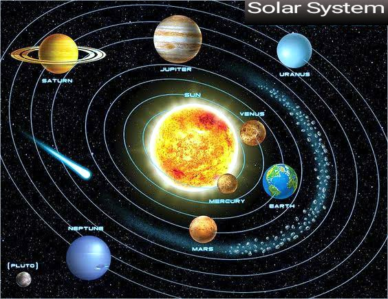
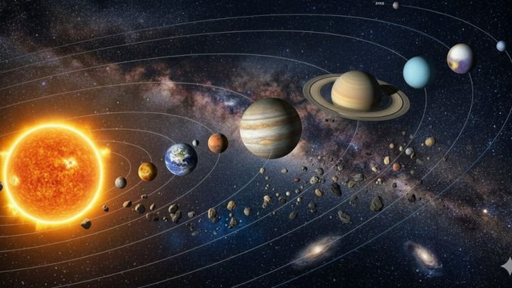
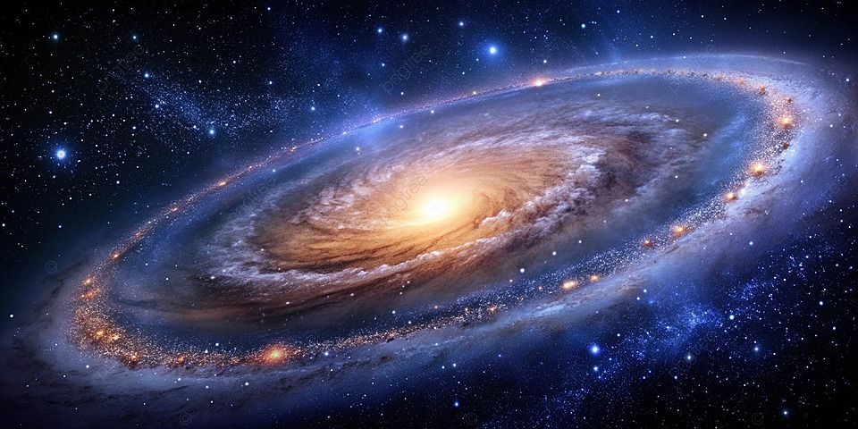
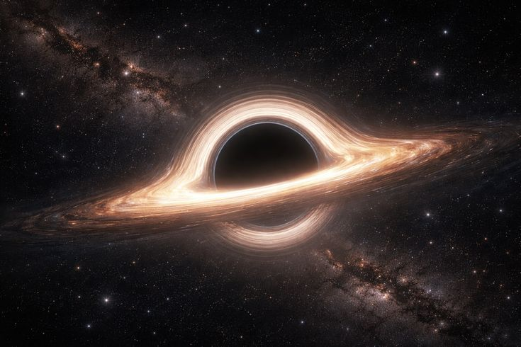
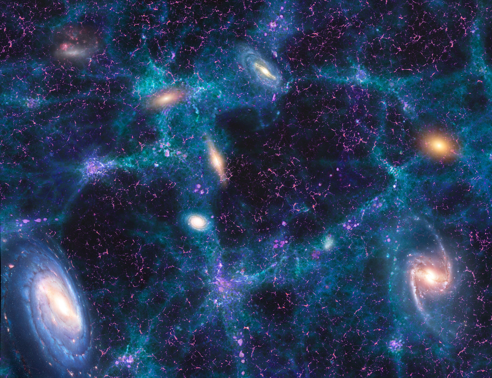

<div align="center">


# 🌌 CosmosXplorer

### *Journey from Planets to the Multiverse*

[](https://flutter.dev)
[](https://dart.dev)
[](https://play.google.com)
[](https://anthropic.com)
[](LICENSE)

> **CosmosXplorer** is a beautifully crafted space exploration app that takes you on an immersive journey through the universe — from the 8 planets of our Solar System to the mind-bending theories of the Multiverse. Built with passion for space and education.

[✨ Features](#-features) • [📸 Screenshots](#-screenshots) • [🚀 Getting Started](#-getting-started) • [🤖 AI Assistant](#-nova-ai-assistant) • [🗺️ Roadmap](#️-roadmap)

</div>

---

## ✨ Features

### 🪐 Solar System Explorer
- Explore all **8 planets** with real NASA-quality images
- Detailed facts: diameter, distance, temperature
- 💡 Fun facts + 🐟 mind-blowing scientific facts for every planet
- Stunning hero images with smooth animations

### ☀️ Solar System Overview
- Compact, information-dense system facts grid
- Zone explorer: Inner System, Asteroid Belt, Kuiper Belt, Oort Cloud
- Planet thumbnail carousel with real photos

### 🌌 Galaxies
- 6 notable galaxies with real telescope images
- Galaxy type classification (Spiral, Elliptical, Lenticular, Irregular)
- Tap any galaxy → full detail sheet with stats and facts

### 🕳️ Black Holes
- 6 types of black holes — all with real scientific imagery
- Includes Sagittarius A*, M87*, Stellar, Intermediate, Quasar & Primordial
- The physics explained in engaging, accessible language

### 🔭 Universe
- Big Bang Timeline — visualized as a beautiful vertical journey
- Key facts grid: age, size, dark matter, dark energy and more
- The 5% fact that will blow your mind

### ♾️ Multiverse
- 6 major multiverse theories with stunning concept art
- Bubble Universe, Many-Worlds, String Theory, Simulation Theory and more
- Each theory includes scientific evidence and mind-blowing implications

### 🤖 NOVA — AI Space Assistant
- Powered by **Claude AI (Anthropic)**
- Ask anything about space, cosmos, or the universe
- Conversational chat interface with typing animation
- Suggestion chips for quick exploration

### 🔍 Search
- Search across **28+ cosmic objects** instantly
- Filter by category: Planet, Galaxy, Black Hole, Universe, Multiverse
- Tap any result → instant info card

### 🧠 Cosmic Quiz
- **15 randomized questions** about space
- Instant feedback with explanations
- Score grades: 🏆 Cosmic Genius → 🌍 Earthling

### 🌟 More
- 🌠 Animated splash screen with starfield
- 🪐 3D rotating planet on home screen
- 💫 Daily Cosmic Fact of the Day
- ⚙️ Settings & About screen

---

## 📸 Screenshots

<div align="center">

| Home Screen | Planets | Solar System |
|:-----------:|:-------:|:------------:|
|  |  |  |

| Galaxies | Black Holes | NOVA AI |
|:--------:|:-----------:|:-------:|
|  |  |  |

</div>

---

## 🚀 Getting Started

### Prerequisites
- Flutter SDK 3.x+
- Dart 3.x+
- Android Studio / VS Code
- Android SDK (for Android builds)

### Installation

```bash
# Clone the repository
git clone https://github.com/meghanadh516/cosmos_Xplorer.git

# Navigate to project
cd cosmos_Xplorer

# Install dependencies
flutter pub get

# Run the app
flutter run
```

### Setting up NOVA AI

1. Get an API key from [console.anthropic.com](https://console.anthropic.com)
2. Open `lib/screens/ai_assistant_screen.dart`
3. Replace `YOUR_API_KEY_HERE` with your actual key
4. Add credits at [console.anthropic.com/billing](https://console.anthropic.com/billing)

> ⚠️ Never commit your real API key to GitHub!

---

## 🤖 NOVA AI Assistant

NOVA is powered by **Claude** (Anthropic's AI) and is specialized in:

- 🪐 Planetary science & Solar System facts
- 🌌 Galactic astronomy & deep space
- 🕳️ Black hole physics & general relativity
- 🔭 Cosmology & universe structure
- ♾️ Multiverse theories & quantum mechanics

---

## 🏗️ Architecture

```
cosmos_xplorer/
├── lib/
│   ├── main.dart                    # Entry point
│   └── screens/
│       ├── splash_screen.dart       # Animated intro
│       ├── home_screen.dart         # Main hub
│       ├── planets_screen.dart      # 8 planets
│       ├── solar_system_screen.dart # Solar System
│       ├── galaxy_screen.dart       # Galaxies
│       ├── blackhole_screen.dart    # Black Holes
│       ├── universe_screen.dart     # Universe
│       ├── multiverse_screen.dart   # Multiverse
│       ├── search_screen.dart       # Search
│       ├── quiz_screen.dart         # Quiz
│       ├── ai_assistant_screen.dart # NOVA AI
│       └── settings_screen.dart     # Settings
├── assets/
│   └── images/                      # All space imagery
└── pubspec.yaml
```

---

## 📦 Tech Stack

| Technology | Purpose |
|-----------|---------|
| **Flutter** | Cross-platform UI framework |
| **Dart** | Programming language |
| **Google Fonts** | Orbitron + Rajdhani typography |
| **Animate Do** | Smooth entrance animations |
| **HTTP** | API communication |
| **Claude AI** | NOVA AI assistant |
| **Flutter Launcher Icons** | App icon generation |

---

## 🗺️ Roadmap

- [x] Solar System with all 8 planets
- [x] Galaxy explorer with real images
- [x] Black Hole types with photography
- [x] Universe timeline & facts
- [x] Multiverse theories
- [x] NOVA AI Assistant
- [x] Cosmic Quiz
- [x] Search functionality
- [x] Animated splash screen
- [x] 3D rotating planet on home
- [ ] iOS support
- [ ] Offline mode for NOVA
- [ ] AR planet viewer
- [ ] Push notifications for space events
- [ ] Multiple languages support
- [ ] Dark/Light theme toggle

---

## 🤝 Contributing

Contributions are welcome! Feel free to:

1. Fork the repository
2. Create a feature branch (`git checkout -b feature/AmazingFeature`)
3. Commit your changes (`git commit -m 'Add AmazingFeature'`)
4. Push to the branch (`git push origin feature/AmazingFeature`)
5. Open a Pull Request

---

## 📄 License

This project is licensed under the MIT License — see the [LICENSE](LICENSE) file for details.

---

## 👨‍💻 Developer

<div align="center">

Built with ❤️ and a passion for the cosmos

**"The universe is under no obligation to make sense to you."**
*— Neil deGrasse Tyson*

⭐ **Star this repo if CosmosXplorer inspired your curiosity about the universe!** ⭐

[](https://github.com/meghanadh516)

</div>

---

<div align="center">
<sub>Made with Flutter 💙 | Powered by Claude AI 🤖 | Exploring the cosmos ✨</sub>
</div>
